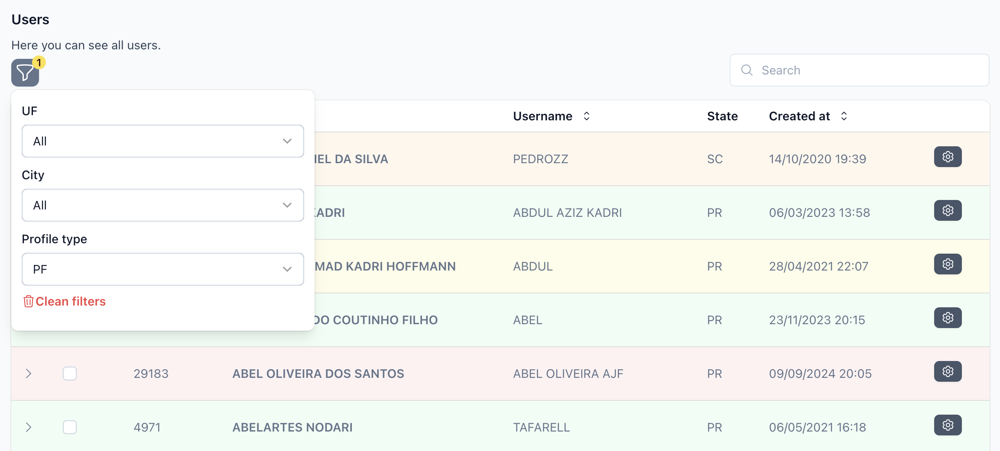

# Livewire Simple Tables

A powerful Laravel Livewire package that simplifies the creation of interactive, feature-rich data tables with minimal effort.

## Overview

Livewire Simple Tables is designed to help Laravel developers quickly build beautiful, interactive data tables without the complexity often associated with table implementations. This package leverages Laravel Livewire to provide a reactive, real-time user experience.



## Features

- **Easy to Set Up**: Get started with just a few lines of code
- **Powerful Data Management**: Built-in pagination, sorting, and searching
- **Customizable Filters**: Create dependent, reactive filters to narrow down data
- **Interactive Actions**: Add row-level actions and bulk operations
- **Row Detail Views**: Expand rows to show additional information
- **Beautifully Styled**: Built with Tailwind CSS for a clean, modern look
- **Highly Extensible**: Create custom themes, filters, and components

## Installation

```bash
composer require tiagospem/simple-tables
```

For detailed installation instructions, see the [Installation Guide](https://tiagospem.github.io/livewire-simple-tables/installation).

## Quick Start

### Create a Table Component

```bash
php artisan st:create table UsersTable
```

### Implement the Table Component

```php
<?php

namespace App\Livewire;

use App\Models\User;
use Illuminate\Database\Eloquent\Builder;
use TiagoSpem\SimpleTables\Column;
use TiagoSpem\SimpleTables\SimpleTableComponent;

class UsersTable extends SimpleTableComponent
{
    public function columns(): array
    {
        return [
            Column::text('ID', 'id')->sortable(),
            Column::text('Name', 'name')->sortable()->searchable(),
            Column::text('Email', 'email')->searchable(),
            Column::text('Created At', 'created_at')->sortable(),
        ];
    }

    public function datasource(): Builder
    {
        return User::query();
    }
}
```

### Add to Your Blade View

```blade
<div>
    <h1>Users</h1>
    
    <div class="mt-4">
        <livewire:users-table />
    </div>
</div>
```

## Documentation

For comprehensive documentation, visit [https://tiagospem.github.io/livewire-simple-tables/](https://tiagospem.github.io/livewire-simple-tables/)

- [Installation](https://tiagospem.github.io/livewire-simple-tables/installation)
- [Configuration](https://tiagospem.github.io/livewire-simple-tables/configuration)
- [Basic Usage](https://tiagospem.github.io/livewire-simple-tables/usage/basic)
- [Advanced Usage](https://tiagospem.github.io/livewire-simple-tables/usage/advanced)
- [Components](https://tiagospem.github.io/livewire-simple-tables/components/actions)

## Requirements

- PHP 8.3+
- Laravel 10+
- Livewire 3.5.4+
- Tailwind CSS v3

## License

This package is open-sourced software licensed under the [MIT license](LICENSE.md).
